# AWS Learning Platform - Architecture Diagram

## System Architecture Overview

```mermaid
graph TB
    %% User Layer
    subgraph "User Layer"
        U1[👤 Students]
        U2[👨‍💼 Admins]
        U3[📱 Mobile Users]
    end

    %% Frontend Layer
    subgraph "Frontend Layer"
        WEB[🌐 Next.js Web App]
        ADMIN[⚙️ Admin Panel]
        DASH[📊 User Dashboard]
        GAMES[🎮 Architecture Builder]
    end

    %% API Layer
    subgraph "API Layer"
        API[🔌 Next.js API Routes]
        AUTH[🔐 Authentication API]
        TUTORIAL[📚 Tutorial API]
        UPLOAD[📤 Screenshot Upload]
        PROGRESS[📈 Progress Tracking]
    end

    %% AWS Services
    subgraph "AWS Cloud Services"
        subgraph "Compute & Hosting"
            AMPLIFY[🚀 AWS Amplify]
            ECS[🐳 ECS Fargate]
            LAMBDA[⚡ Lambda Functions]
        end
        
        subgraph "Storage & Database"
            S3[🪣 S3 Bucket<br/>Screenshots & Assets]
            DYNAMO[🗄️ DynamoDB<br/>Users & Progress]
        end
        
        subgraph "Identity & Access Management"
            COGNITO[🔑 AWS Cognito<br/>User Management]
            IAM[🛡️ AWS IAM<br/>Roles & Policies]
        end
        
        subgraph "Content Delivery"
            CLOUDFRONT[☁️ CloudFront CDN]
        end
    end

    %% Data Flow
    U1 --> WEB
    U2 --> ADMIN
    U3 --> WEB
    
    WEB --> API
    ADMIN --> API
    DASH --> API
    GAMES --> API
    
    API --> AUTH
    API --> TUTORIAL
    API --> UPLOAD
    API --> PROGRESS
    
    AUTH --> COGNITO
    TUTORIAL --> DYNAMO
    UPLOAD --> S3
    PROGRESS --> DYNAMO
    
    COGNITO --> IAM
    S3 --> IAM
    DYNAMO --> IAM
    
    AMPLIFY --> WEB
    ECS --> API
    LAMBDA --> API
    
    S3 --> CLOUDFRONT
    CLOUDFRONT --> WEB
```

## Component Architecture

```mermaid
graph LR
    subgraph "Frontend Components"
        A[🏠 Homepage]
        B[📖 Tutorial Pages]
        C[🎯 Games & Quizzes]
        D[👤 User Dashboard]
        E[⚙️ Admin Panel]
    end
    
    subgraph "Core Features"
        F[🔍 Search & Filter]
        G[📊 Progress Tracking]
        H[🏗️ Architecture Builder]
        I[💬 Comments System]
        J[⭐ Rating System]
    end
    
    subgraph "Data Management"
        K[📝 Tutorial Content]
        L[🖼️ Screenshot Storage]
        M[👥 User Management]
        N[📈 Analytics]
    end
    
    A --> F
    B --> G
    C --> H
    D --> I
    E --> J
    
    F --> K
    G --> M
    H --> L
    I --> N
    J --> N
```

## Technology Stack

## Data Flow Architecture

## Deployment Architecture

```mermaid
graph TB
    subgraph "Development"
        DEV[💻 Local Development<br/>npm run dev]
        GIT[📁 Git Repository]
    end
    
    subgraph "CI/CD Pipeline"
        BUILD[🔨 Build Process<br/>npm run build]
        TEST[🧪 Testing]
        DEPLOY[🚀 Deploy]
    end
    
    subgraph "Production Environment"
        AMPLIFY_PROD[🚀 AWS Amplify<br/>Production]
        CUSTOM_DOMAIN[🌐 Custom Domain]
        SSL[🔒 SSL Certificate]
    end
    
    subgraph "Monitoring & Analytics"
        CLOUDWATCH[📊 CloudWatch]
        AMPLIFY_ANALYTICS[📈 Amplify Analytics]
    end
    
    DEV --> GIT
    GIT --> BUILD
    BUILD --> TEST
    TEST --> DEPLOY
    DEPLOY --> AMPLIFY_PROD
    AMPLIFY_PROD --> CUSTOM_DOMAIN
    CUSTOM_DOMAIN --> SSL
    
    AMPLIFY_PROD --> CLOUDWATCH
    AMPLIFY_PROD --> AMPLIFY_ANALYTICS
```

## Security Architecture

```mermaid
graph TB
    subgraph "Authentication Flow"
        LOGIN[🔐 User Login]
        COGNITO_AUTH[🔑 Cognito Authentication]
        JWT[🎫 JWT Tokens]
        SESSION[📝 Session Management]
    end
    
    subgraph "IAM & Authorization"
        IAM_ROLES[🛡️ IAM Roles & Policies]
        RBAC[👥 Role-Based Access]
        ADMIN_ROLE[⚙️ Admin Role]
        USER_ROLE[👤 User Role]
        LEAST_PRIVILEGE[🔒 Least Privilege Principle]
    end
    
    subgraph "Data Security"
        ENCRYPTION[🔒 Data Encryption]
        HTTPS[🔐 HTTPS/TLS]
        CORS[🛡️ CORS Policy]
    end
    
    subgraph "AWS Service Security"
        S3_IAM[🪣 S3 IAM Policies]
        DYNAMO_IAM[🗄️ DynamoDB IAM Roles]
        PRESIGNED_URLS[🔗 Presigned URLs]
        ACCESS_CONTROL[🚪 Access Control]
    end
    
    LOGIN --> COGNITO_AUTH
    COGNITO_AUTH --> JWT
    JWT --> SESSION
    
    SESSION --> IAM_ROLES
    IAM_ROLES --> RBAC
    RBAC --> ADMIN_ROLE
    RBAC --> USER_ROLE
    RBAC --> LEAST_PRIVILEGE
    
    IAM_ROLES --> ENCRYPTION
    ENCRYPTION --> HTTPS
    HTTPS --> CORS
    
    IAM_ROLES --> S3_IAM
    IAM_ROLES --> DYNAMO_IAM
    S3_IAM --> PRESIGNED_URLS
    DYNAMO_IAM --> ACCESS_CONTROL
```

## Key Features Architecture

### 1. Tutorial System
- **Content Management**: DynamoDB stores tutorial metadata
- **Screenshots**: S3 stores tutorial images with CDN delivery
- **Progress Tracking**: Real-time progress updates via API
- **Link Support**: Automatic URL detection and rendering

### 2. Architecture Builder
- **Drag & Drop**: Interactive component placement
- **Visual Connections**: Network relationship mapping
- **Export/Import**: JSON-based architecture sharing
- **Templates**: Pre-built AWS architecture patterns

### 3. User Management
- **Authentication**: AWS Cognito integration
- **Role-Based Access**: Admin vs User permissions
- **Progress Analytics**: Learning statistics and achievements
- **Session Management**: Secure cookie-based sessions

### 4. Identity & Access Management (IAM)
- **Role-Based Access Control**: Admin vs User permissions
- **AWS IAM Integration**: Service roles for S3, DynamoDB, Cognito
- **Least Privilege Principle**: Minimal required permissions
- **Custom Attributes**: Role management in Cognito
- **Service Authentication**: IAM roles for AWS service access

### 5. Content Delivery
- **Static Assets**: S3 + CloudFront CDN
- **Dynamic Content**: Next.js server-side rendering
- **Image Optimization**: Automatic image compression
- **Global Distribution**: Multi-region CDN deployment

## Scalability Considerations

- **Horizontal Scaling**: ECS Fargate auto-scaling
- **Database Scaling**: DynamoDB auto-scaling
- **CDN Distribution**: Global content delivery
- **Caching Strategy**: Multi-layer caching (browser, CDN, API)
- **Load Balancing**: Application Load Balancer for high availability

## Monitoring & Observability

- **Application Monitoring**: CloudWatch metrics and logs
- **Performance Tracking**: Real User Monitoring (RUM)
- **Error Tracking**: Centralized error logging
- **User Analytics**: Learning progress and engagement metrics
